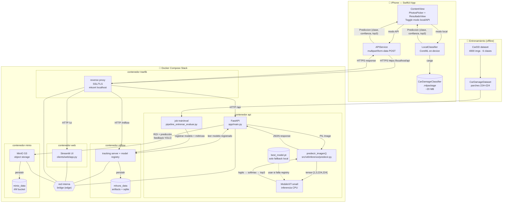
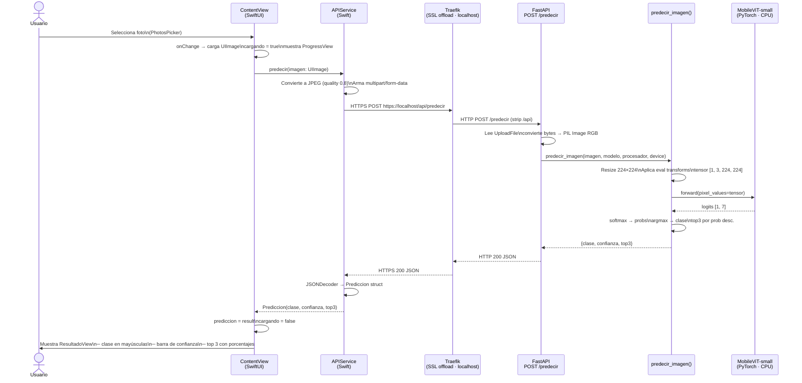
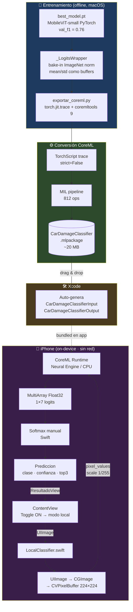
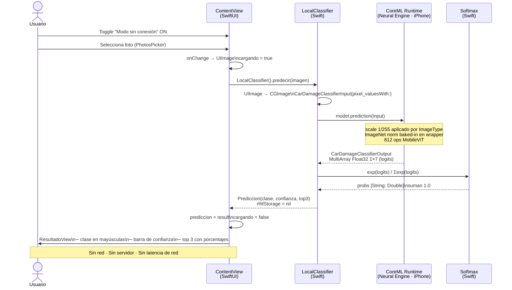
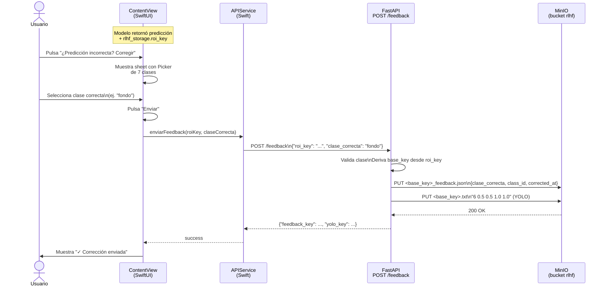
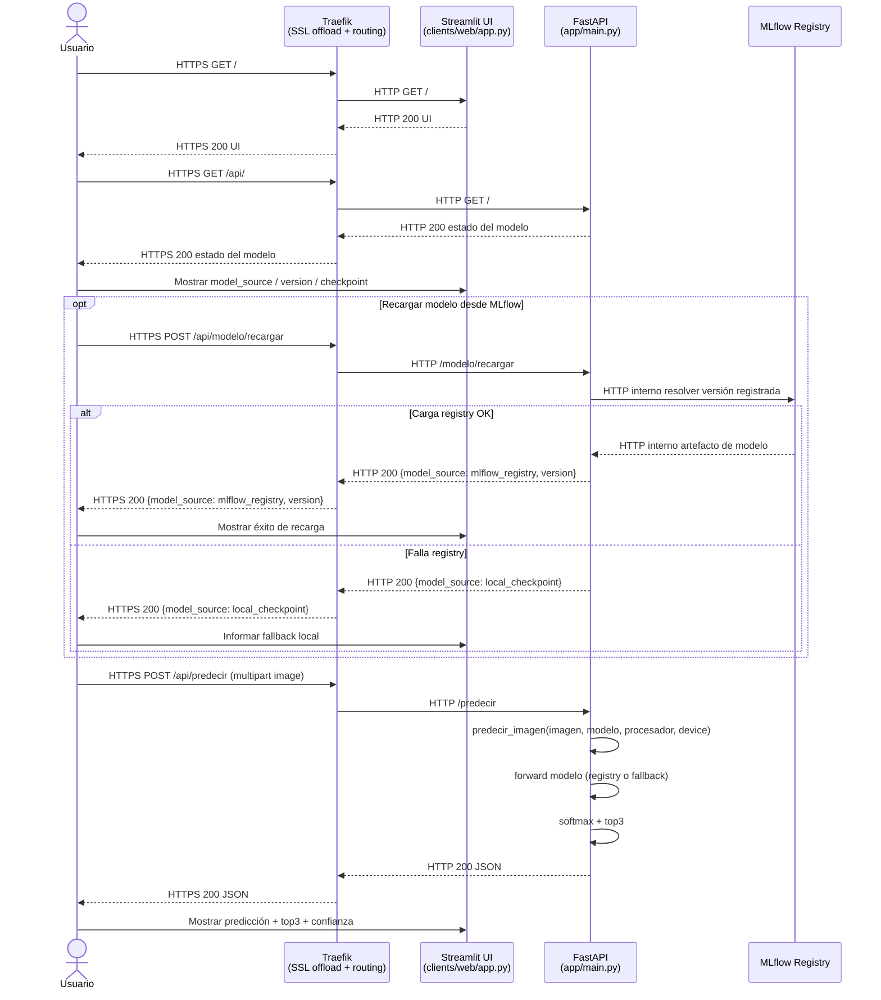

# car-damage-vit

Clasificación de daños en vehículos usando Vision Transformers.

---

## Arquitectura del sistema



---

## Flujo de interacción — demo iPhone



---

## Edge AI — Inferencia on-device (CoreML)

MobileViT-small fue exportado a `.mlpackage` mediante `scripts/exportar_coreml.py` y puede correr directamente en el Neural Engine del iPhone sin red ni servidor.



### Comparación de modos

| | Modo API | Modo Edge AI |
|---|---|---|
| **Dónde corre** | Docker (CPU) en Mac | Neural Engine del iPhone |
| **Red requerida** | Sí (HTTPS localhost) | No |
| **Latencia** | ~200–500 ms | ~50–150 ms |
| **RLHF / feedback** | Sí (MinIO) | No |
| **Toggle** | OFF | ON |

### Cómo generar el `.mlpackage`

```bash
conda activate car-damage-vit
python scripts/exportar_coreml.py
# → checkpoints/mobilevit_small/CarDamageClassifier.mlpackage
```

---

## Flujo de interacción — demo iPhone (modo Edge AI)



---

## Flujo de corrección humana — demo iPhone



---

## Flujo de interacción — interfaz web



---

## ¿De qué se trata?

Fine-tuning de modelos ViT livianos sobre el dataset CarDD para identificar y clasificar tipos de daños en autos. El dataset cubre seis categorías: abolladuras, rayones, fisuras, roturas de vidrio, neumáticos pinchados y faros dañados.

La estrategia central es trabajar con parches de 224×224 px extraídos de las imágenes originales de alta resolución, lo que permite usar modelos livianos sin perder detalle visual relevante.

---

## Modelos

| Modelo | Parámetros | Descripción |
|---|---|---|
| `facebook/deit-tiny-patch16-224` | ~5.7M | ViT compacto, eficiente en recursos |
| `apple/mobilevit-small` | ~5.6M | Híbrido CNN-Transformer para móviles |
| `openai/clip-vit-base-patch32` | ~151M | Evaluación zero-shot multimodal |

---

## Dataset

[CarDD](https://huggingface.co/datasets/harpreetsahota/CarDD) — 4.000 imágenes de alta resolución con anotaciones en formato COCO (bounding boxes + máscaras de segmentación). Uso no comercial.

**Clases:** dent · scratch · crack · glass shatter · tire flat · lamp broken

---

## Estructura del proyecto

```
car-damage-vit/
├── app/              # API de inferencia (FastAPI)
├── configs/          # Configuraciones por modelo y entorno
├── data/             # raw → interim → processed
├── docs/             # Documentación técnica
├── experiments/      # Registro de experimentos
├── logs/             # Logs de entrenamiento
├── models/           # Metadatos del modelo en producción
├── notebooks/        # EDA, entrenamiento y visualizaciones
├── reports/          # Métricas y figuras exportadas
├── scripts/          # Entry points CLI
├── src/vit/          # Código fuente principal
└── tests/            # Tests unitarios, de integración y e2e
```

---

## Cómo iniciar

Hay dos caminos según lo que querés hacer:

---

### Camino A — Correr el stack (API + UI + MLflow)

**Prerequisito:** Docker Desktop (macOS) o Docker Engine + Compose v2 (Linux).

> `mkcert` y sus dependencias los instala automáticamente `scripts/setup_dev.sh`.

#### A1. Variables de entorno (una vez)

```bash
cp .env_example .env
```

Editá `.env` y asigná credenciales para MinIO (cualquier valor sirve para desarrollo local):

```
MINIO_ROOT_USER=admin
MINIO_ROOT_PASSWORD=admin1234
```

#### A2. Certificados TLS locales (una vez)

Genera certificados confiados por el sistema para `localhost`:

```bash
bash scripts/setup_dev.sh
```

> **Linux:** el script necesita `sudo` para instalar la CA y puede pedir contraseña.
> **Después de correr el script:** reiniciá el navegador completamente (Cmd+Q en macOS, cerrar todas las ventanas en Linux) para que tome el nuevo CA.

#### A3. Construir y levantar

```bash
docker compose build
docker compose up -d
```

Verificar que los 5 servicios estén `Up`:

```bash
docker compose ps
```

Servicios disponibles:

- Web UI (Streamlit): `https://localhost/ui/`
- API (vía Traefik): `https://localhost/api/`
- MLflow UI: `https://localhost/mlflow/`
- Traefik Dashboard: `https://localhost/dashboard/`
- MinIO Console (directo, sin Traefik): `http://localhost:9001`

---

### Camino B — Entrenar modelos

**Prerequisito:** Camino A corriendo (MLflow necesita estar activo para registrar experimentos).

#### B1. Crear el entorno local

```bash
conda env create -f environment.yml
conda activate car-damage-vit
```

#### B2. Configurar GPU

| Plataforma | Acción |
|---|---|
| macOS Apple Silicon (M1/M2/M3) | Nada extra — PyTorch usa MPS automáticamente |
| Linux con GPU NVIDIA | Ver abajo |

```bash
# CUDA 11.8
pip install torch torchvision --index-url https://download.pytorch.org/whl/cu118

# CUDA 12.1
pip install torch torchvision --index-url https://download.pytorch.org/whl/cu121
```

Verificar versión de CUDA: `nvidia-smi`

#### B3. Ejecutar pipeline end-to-end (train + eval)

`pipeline_entrenar_evaluar.py` corre en una sola corrida: prepara datos, entrena y evalúa sobre test.

```bash
python scripts/pipeline_entrenar_evaluar.py \
  --config model/mobilevit_small.yaml \
  --env dev --mlflow-uri http://localhost:6000 \
  --mlflow-train-experiment car-damage-vit-train \
  --mlflow-eval-experiment car-damage-vit-eval \
  --mlflow-register-name car-damage-mobilevit
```

Splits:
- `train` → optimizar el modelo por época
- `validation` → validar por época durante entrenamiento
- `test` → solo en evaluación final (`scripts/evaluar.py`)

Al iniciar el run, registrar el dataset en el campo **Dataset** de MLflow y subir artifacts de `data/raw/{train,validation,test,annotations}`.

#### B4. Registrar en Model Registry y asignar alias para serving

Pasar `--mlflow-register-name car-damage-mobilevit` registra el modelo en MLflow Model Registry.

Asignar alias `production` a la última versión para que la API lo cargue automáticamente:

```bash
python -c "from mlflow.tracking import MlflowClient; c=MlflowClient('http://localhost:6000'); name='car-damage-mobilevit'; v=max(c.search_model_versions(f\"name='{name}'\"), key=lambda m:int(m.version)); c.set_registered_model_alias(name, 'production', v.version); print(f'Alias production -> v{v.version}')"
```

> En la UI de MLflow → Model Registry, el modelo debe mostrar `Aliases: @ production`.

Si la carga desde Registry falla, la API usa como fallback automático `checkpoints/mobilevit_small/best_model.pt`.

---

## Docker

La UI web muestra el estado del modelo activo y ofrece el botón **Cargar última desde MLflow** (endpoint `POST /modelo/recargar`).

Si la carga desde Model Registry falla, la API usa fallback automático al checkpoint local `checkpoints/mobilevit_small/best_model.pt` e informa ese estado en la UI.

Los datos de tracking y artifacts de MLflow se persisten en el volumen `mlruns_data`.


## Desarrollo y debugging

### Correr la API fuera de Docker

Útil para iterar sobre `app/main.py` sin rebuilds:

```bash
conda activate car-damage-vit
python -m uvicorn app.main:app --host 0.0.0.0 --port 8000
```

> Usar `python -m uvicorn` (no `uvicorn` directamente) para garantizar que se usa el Python del entorno conda y no el del sistema.

Verificar:

```bash
curl http://localhost:8000/
# {"estado":"ok","version":"0.1.0","modelo":"mobilevit-small"}
```

Probar inferencia:

```bash
curl -X POST http://localhost:8000/predecir \
  -F "archivo=@data/sample_test.jpg" | python3 -m json.tool
```

---

## Dependencias

El proyecto tiene tres archivos de dependencias según el contexto:

| Archivo | Uso | Deps incluidas |
|---|---|---|
| `requirements.txt` | Desarrollo completo (entrenamiento, notebooks, tests) | torch, transformers, datasets, fiftyone, scikit-learn, matplotlib, pytest, ... |
| `requirements-prod.txt` | API de inferencia en producción / Docker | torch CPU, transformers, fastapi, uvicorn, Pillow, python-multipart |
| `requirements-ci.txt` | Pipeline de CI (GitHub Actions) | subset para correr tests sin GPU |

Instalar según el contexto:

```bash
# Desarrollo local (entorno completo)
conda env create -f environment.yml

# Solo la API (sin conda, ej. servidor o Docker)
pip install -r requirements-prod.txt

# CI
pip install -r requirements-ci.txt
```
