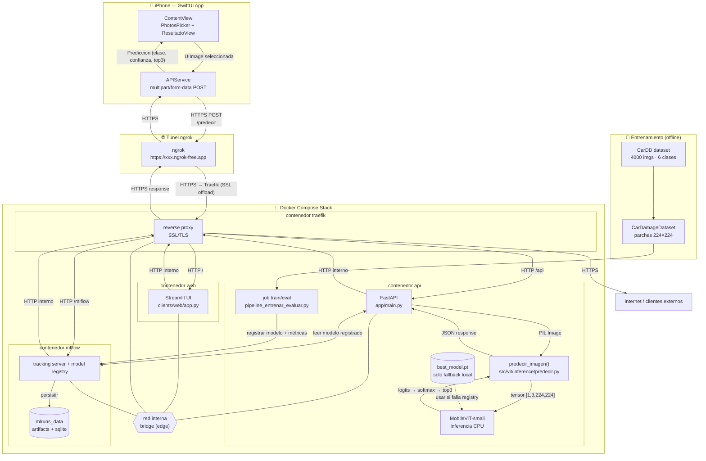
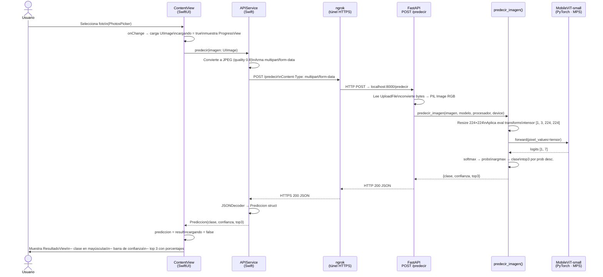
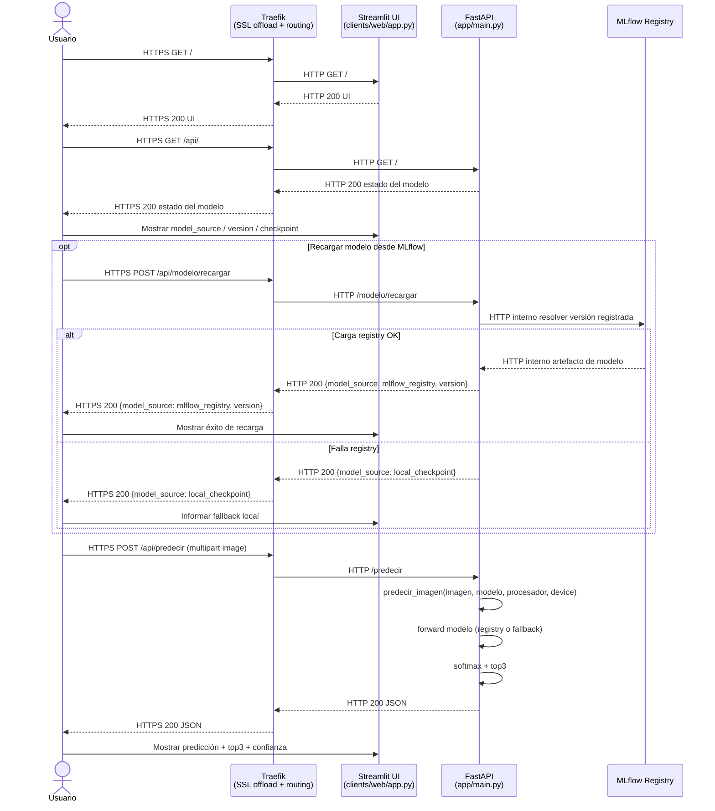

# car-damage-vit

Clasificación de daños en vehículos usando Vision Transformers.

---

## Arquitectura del sistema



---

## Flujo de interacción — demo iPhone



---

## Flujo de interacción — interfaz web



---

## ¿De qué se trata?

Fine-tuning de modelos ViT livianos sobre el dataset CarDD para identificar y clasificar tipos de daños en autos. El dataset cubre seis categorías: abolladuras, rayones, fisuras, roturas de vidrio, neumáticos pinchados y faros dañados.

La estrategia central es trabajar con parches de 224×224 px extraídos de las imágenes originales de alta resolución, lo que permite usar modelos livianos sin perder detalle visual relevante.

---

## Modelos

| Modelo | Parámetros | Descripción |
|---|---|---|
| `facebook/deit-tiny-patch16-224` | ~5.7M | ViT compacto, eficiente en recursos |
| `apple/mobilevit-small` | ~5.6M | Híbrido CNN-Transformer para móviles |
| `openai/clip-vit-base-patch32` | ~151M | Evaluación zero-shot multimodal |

---

## Dataset

[CarDD](https://huggingface.co/datasets/harpreetsahota/CarDD) — 4.000 imágenes de alta resolución con anotaciones en formato COCO (bounding boxes + máscaras de segmentación). Uso no comercial.

**Clases:** dent · scratch · crack · glass shatter · tire flat · lamp broken

---

## Estructura del proyecto

```
car-damage-vit/
├── app/              # API de inferencia (FastAPI)
├── configs/          # Configuraciones por modelo y entorno
├── data/             # raw → interim → processed
├── docs/             # Documentación técnica
├── experiments/      # Registro de experimentos
├── logs/             # Logs de entrenamiento
├── models/           # Metadatos del modelo en producción
├── notebooks/        # EDA, entrenamiento y visualizaciones
├── reports/          # Métricas y figuras exportadas
├── scripts/          # Entry points CLI
├── src/vit/          # Código fuente principal
└── tests/            # Tests unitarios, de integración y e2e
```

---

## Cómo iniciar

### 1. Crear el entorno

```bash
conda env create -f environment.yml
conda activate car-damage-vit
```

### 2. Configurar GPU por plataforma

| Plataforma | Acción a realizar |
|---|---|
| macOS Apple Silicon (M1/M2/M3) | Nada extra. PyTorch usa MPS automáticamente. |
| Linux / Windows con GPU NVIDIA | Ver abajo. |

En Linux o Windows con CUDA, después de crear el entorno:

```bash
# CUDA 11.8
pip install torch torchvision --index-url https://download.pytorch.org/whl/cu118

# CUDA 12.1
pip install torch torchvision --index-url https://download.pytorch.org/whl/cu121
```

Verificar versión de CUDA: `nvidia-smi`

### 3. Levantar stack local (MLflow + API + UI)

```bash
docker compose build
docker compose up -d
```

Consultar servicios principales:

- Web UI (Streamlit): `https://localhost/`
- API (vía Traefik): `https://localhost/api/`
- MLflow UI: `https://localhost/mlflow`

### 4. Ejecutar pipeline end-to-end (train + eval)

Ejecutar `scripts/pipeline_entrenar_evaluar.py` en una sola corrida para dentro del entorno virtual del host:

1. preparar datos (si faltan splits o anotaciones),
2. entrenar,
3. evaluar sobre test.

Usar el siguiente comando recomendado:

```bash
python scripts/pipeline_entrenar_evaluar.py \
  --config model/mobilevit_small.yaml \
  --env dev --mlflow-uri http://localhost:6000 \
  --mlflow-train-experiment car-damage-vit-train \
  --mlflow-eval-experiment car-damage-vit-eval \
  --mlflow-register-name car-damage-mobilevit
```

### 5. Usar cada split del dataset en cada etapa

- `train`: usar para optimizar el modelo durante entrenamiento.
- `validation`: usar para validar por época durante entrenamiento.
- `test`: usar solo en la evaluación final (`scripts/evaluar.py`).

Además, al iniciar el run de train, registrar el dataset en el campo **Dataset** de MLflow y subir artifacts de:

- `data/raw/train`
- `data/raw/validation`
- `data/raw/test`
- `data/raw/annotations`

### 6. Registrar en Model Registry y asignar alias para serving

Pasar `--mlflow-register-name car-damage-mobilevit` para registrar el modelo en MLflow Model Registry.

Asignar alias a la última versión registrada para permitir carga por alias en API (configurada con `MLFLOW_MODEL_ALIAS=production`):

```bash
python -c "from mlflow.tracking import MlflowClient; c=MlflowClient('http://localhost:6000'); name='car-damage-mobilevit'; v=max(c.search_model_versions(f\"name='{name}'\"), key=lambda m:int(m.version)); c.set_registered_model_alias(name, 'production', v.version); print(f'Alias production -> v{v.version}')"
```
>Nota: en la UI de MLFlow, dentro de Model Registry, el modelo debe mostrar Aliases: @ production

Si la carga desde Registry falla por incompatibilidad de entorno o conectividad, mantener fallback automático en API hacia `checkpoints/mobilevit_small/best_model.pt`.

---

## API de inferencia

### Levantar la API localmente

```bash
conda activate car-damage-vit
python -m uvicorn app.main:app --host 0.0.0.0 --port 8000
```

> Usar `python -m uvicorn` (no `uvicorn` directamente) para garantizar que se usa el Python del entorno conda y no el del sistema.

Verificar que esté corriendo:

```bash
curl http://localhost:8000/
# {"estado":"ok","version":"0.1.0","modelo":"mobilevit-small"}
```

Probar inferencia:

```bash
curl -X POST http://localhost:8000/predecir \
  -F "archivo=@data/sample_test.jpg" | python3 -m json.tool
```

Respuesta esperada:

```json
{
    "clase": "scratch",
    "confianza": 0.87,
    "top3": [
        {"clase": "scratch", "confianza": 0.87},
        {"clase": "dent",    "confianza": 0.09},
        {"clase": "crack",   "confianza": 0.02}
    ]
}
```

### Exponer la API al iPhone (demo)

```bash
ngrok http 8000
```

Ngrok genera una URL pública HTTPS (ej. `https://abc123.ngrok-free.app`) que el iPhone puede usar desde cualquier red. La URL cambia con cada sesión en el plan gratuito.

Al ejecutar curl a través de ngrok, agregar el header para evitar la página de advertencia:

```bash
curl -X POST https://abc123.ngrok-free.app/predecir \
  -H "ngrok-skip-browser-warning: true" \
  -F "archivo=@data/sample_test.jpg" | python3 -m json.tool
```

---

## Docker

### Stack completo con Docker Compose (recomendado)

Construir imágenes del stack:

```bash
docker compose build
```

Levantar servicios:

```bash
docker compose up -d
```

Consultar servicios principales:

- Web UI (Streamlit): `https://localhost/`
- API (vía Traefik): `https://localhost/api/`
- MLflow UI (vía Traefik): `https://localhost/mlflow`

Mostrar en la UI web el estado del modelo activo de la API y ofrecer el botón **Cargar ultima desde MLflow** (endpoint `POST /modelo/recargar`).

Si la carga desde Model Registry falla por cualquier motivo, mantener fallback automático en la API al checkpoint local `checkpoints/mobilevit_small/best_model.pt` e informar ese estado en la UI.

Persistir los datos de tracking y artifacts de MLflow en el volumen `mlruns_data`.


## Dependencias

El proyecto tiene tres archivos de dependencias según el contexto:

| Archivo | Uso | Deps incluidas |
|---|---|---|
| `requirements.txt` | Desarrollo completo (entrenamiento, notebooks, tests) | torch, transformers, datasets, fiftyone, scikit-learn, matplotlib, pytest, ... |
| `requirements-prod.txt` | API de inferencia en producción / Docker | torch CPU, transformers, fastapi, uvicorn, Pillow, python-multipart |
| `requirements-ci.txt` | Pipeline de CI (GitHub Actions) | subset para correr tests sin GPU |

Instalar según el contexto:

```bash
# Desarrollo local (entorno completo)
conda env create -f environment.yml

# Solo la API (sin conda, ej. servidor o Docker)
pip install -r requirements-prod.txt

# CI
pip install -r requirements-ci.txt
```
